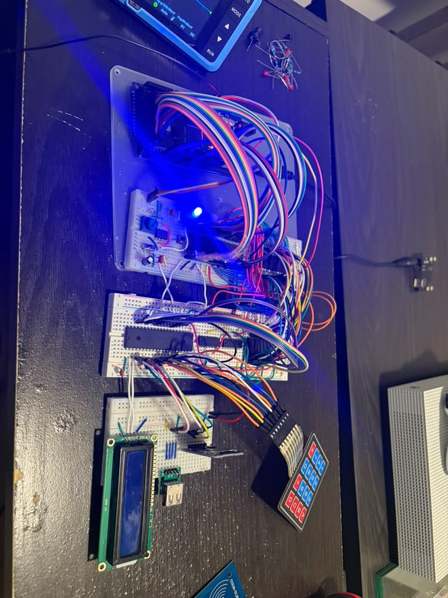

# 6502 Code Monorepo


This is all the code I used to debug, test, and build my 6502 breadbaord computer. `./console` is a debugger for the 6502 cpu, while the actual OS on the EEPROM is in `./6502-os`.

# Memory Map

- 0000 to 5FFF is RAM (24K)
    - 0000 to 00FF is ZP
    - 0100 to 01FF is 6502 stack
    - 0200 to 5FFF is cc65 stack and globals
- 6000 to 600F is MCS6522 I/O
- 6010 to 7FFF is reserved
- 8000 to FFFF is EEPROM (32K)

# Clock speed
I'm using a 555 astable with a potentiometer to run this computer, clock speed can vary from 0.5hz to ~75khz in testing.

# Symbol-aware CPU trace

`scripts/trace_monitor.py` reads the W65C02S monitor over serial and prints the
raw address/data lines with decoded opcodes, cc65 symbols, symbolized reads and
writes, and a JSR/RTS stack trace:

```sh
uv run --with pyserial scripts/trace_monitor.py --port /dev/ttyUSB0
```

`just trace` opens the output in `less` follow mode. Press `Ctrl-C` to stop
following and search with `/`; press `F` to resume following the live trace.

It loads `6502-os/build/OS.lbl` by default. A captured monitor log can be
analyzed without pyserial or attached hardware:

```sh
python scripts/trace_monitor.py --input trace.txt
```

Use `--symbol NAME=ADDR` to add a hardware or application symbol, and
`--no-select` when the console is already in the W65C02S monitor.
